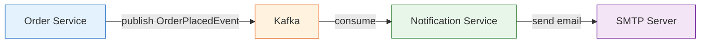

# Notification Service

Listens for order events on Kafka and sends confirmation emails to customers. This is the final step in the purchase flow: after the order service saves an order and publishes an event, this service picks it up and delivers an email.

Built with **Spring Boot 3**, **Spring Kafka** (consumer with Avro deserialization), and **Spring Mail** (JavaMailSender with MIME support).

## What it does

- Consumes `OrderPlacedEvent` messages from the `order-placed` Kafka topic
- Deserializes events using Apache Avro via Confluent Schema Registry
- Builds and sends an HTML-formatted confirmation email to the customer
- Handles mail delivery failures gracefully (logs error, does not retry infinitely)

## How it fits in the system



The service is fully event-driven. It has no REST endpoints, no database, and no synchronous dependencies on other services. It just listens to Kafka and sends emails.

## Kafka event schema

The `OrderPlacedEvent` is serialized with Apache Avro. The consumer uses `ErrorHandlingDeserializer` as a wrapper to handle malformed messages without crashing.

| Field | Type | Description |
|---|---|---|
| `orderNumber` | string | UUID of the placed order |
| `email` | string | Customer email address |
| `firstName` | string | Customer first name |
| `lastName` | string | Customer last name |

## Email template

The service sends a plain-text confirmation email. Example output:

```
From: springshop@email.com
To: john@example.com
Subject: Your Order abc-123-def is placed successfully

Hi John Doe,

Your order with order number abc-123-def has been placed successfully.

Best Regards,
Spring Shop
```

## Error handling

If the SMTP server is unreachable or rejects the message, the service logs the error but does **not** rethrow the exception. This prevents Kafka from retrying the same message in an infinite loop. In a production setup, you'd push failed messages to a dead-letter topic or alert channel instead.

## Running locally

Prerequisites: Java 21, Maven, Kafka on port 9092, Schema Registry on port 8085, an SMTP server (or Mailtrap for testing).

```bash
mvn clean package -DskipTests
java -jar target/notification-service-0.0.1-SNAPSHOT.jar
```

The service starts on port `8089`. It doesn't serve any HTTP traffic (aside from actuator endpoints), it just listens to Kafka.

## Configuration

| Property | Default | Docker override |
|---|---|---|
| `server.port` | `8089` | `8089` |
| `spring.kafka.bootstrap-servers` | `localhost:9092` | `broker:29092` |
| `schema.registry.url` | `http://127.0.0.1:8085` | `http://schema-registry:8085` |
| `spring.mail.host` | `sandbox.smtp.mailtrap.io` | env var `MAIL_HOST` |
| `spring.mail.port` | `2525` | env var `MAIL_PORT` |
| `spring.mail.username` | `changeme` | env var `MAIL_USERNAME` |
| `spring.mail.password` | `changeme` | env var `MAIL_PASSWORD` |

Mail credentials use environment variable fallbacks so you never commit real SMTP passwords.

## Project structure

```
src/main/java/.../notification/
└── service/
    └── NotificationService.java    # Kafka listener + email builder

src/main/java/.../order/event/
└── OrderPlacedEvent.java           # Avro-generated event class

src/main/resources/
├── application.properties
└── application-docker.properties
```

## Tech stack

- Spring Boot 3.3.5
- Spring Kafka (consumer)
- Apache Avro + Confluent Schema Registry
- Spring Mail (JavaMailSender)
- Micrometer + Prometheus
- Lombok
